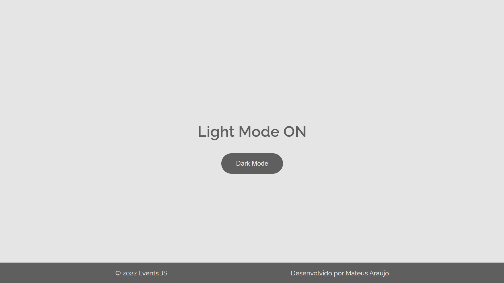
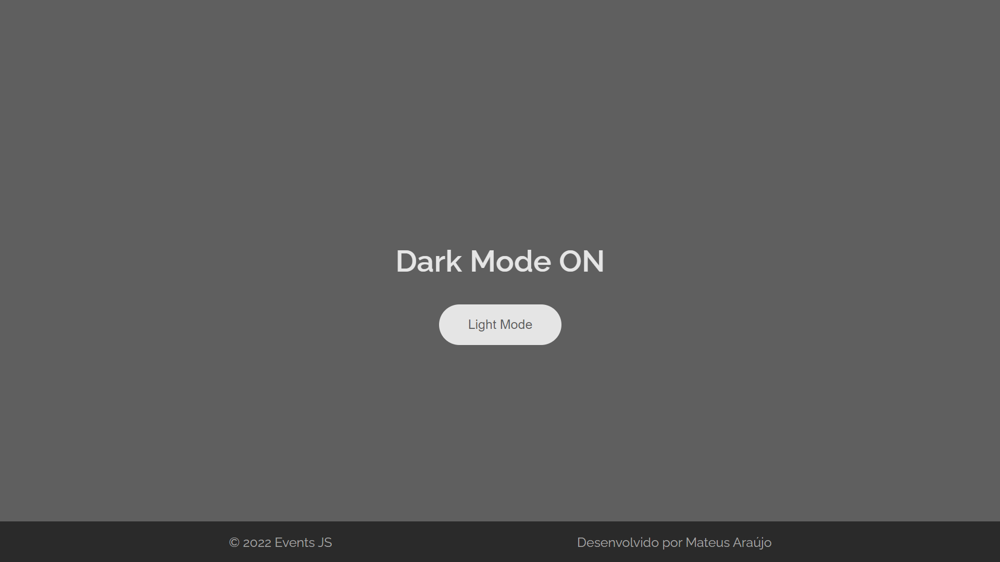
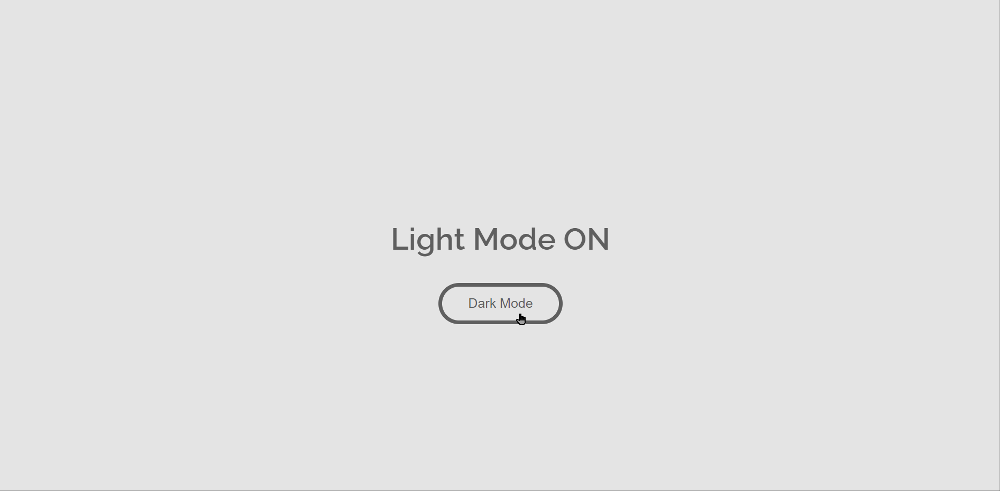

# 🤖 Dark Mode e Light Mode com JavaScript

## 🏙️ Light Mode ON

## 🌃 Dark Mode ON

## Click event

👉 Evento de clique em JavaScript funcionando perfeitamente.

## 💡 Feito com

- [Visual Studio Code](https://code.visualstudio.com/) - É um editor de código desenvolvido pela Microsoft. Ele inclui suporte para depuração, controle de versionamento Git incorporado, realce de sintaxe, complementação inteligente de código, snippets e refatoração de código.

## 💝 Gratidão

- Envie para outras pessoas 📧
- Muito obrigado por acompanhar 👋😎

---

Criado com ❤️ por [Mateus Araújo](https://github.com/mateusaraujos) 😁